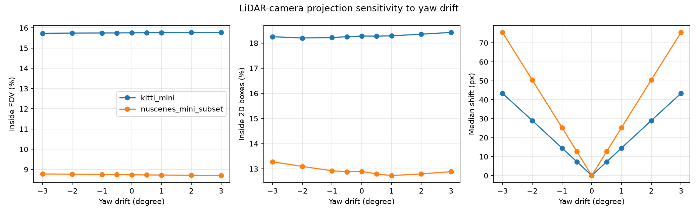
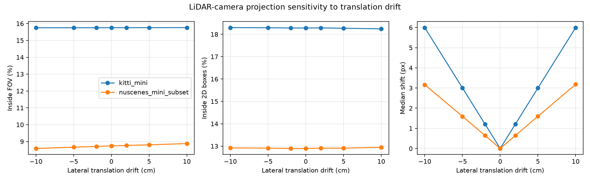
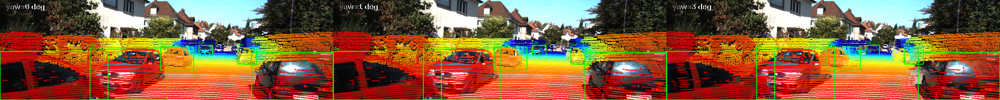

# Báo cáo Day 6: Độ nhạy của LiDAR-camera projection với yaw drift

- **Họ tên:** Nguyễn Mạnh Cường
- **MSSV:** 2A202602823
- **Lớp:** VinAI AI20K — Track 4
- **Link repo:** https://github.com/nmc2004nd/NguyenManhCuong-2A202602823-Track4-Day21
- **Topic:** A — LiDAR-camera projection QA
- **Dataset:** `data/kitti_mini`, `data/nuscenes_mini_subset`
- **Các frame đã dùng:** toàn bộ 20 frame KITTI mini; `scene-0103_000` đến `scene-0103_019` của nuScenes

## 1. Claim

Yaw drift 1° tạo ra độ dịch trung vị 14.55 px trên KITTI và 25.29 px trên nuScenes, đủ lớn để thấy sai lệch trên overlay.
Tuy nhiên, các metric tổng quát như tỷ lệ điểm trong FOV hay trong box 2D gần như không đổi nên không đủ tin cậy để tự phát hiện lỗi.
Nếu có projection chuẩn làm mốc, ngưỡng median pixel shift 5 px phát hiện được drift từ 0.5° trên cả hai tập đã thử.

## 2. Evidence

Mỗi dòng dưới đây là macro-average trên 20 frame; cùng point cloud và calibration gốc được dùng cho mọi mức yaw, không có phép lấy mẫu ngẫu nhiên.
Số liệu yaw đầy đủ nằm tại `results/yaw_perturb_sweep.csv`; sweep translation nằm tại `results/translation_perturb_sweep.csv`.

| Dataset | Yaw (°) | Inside FOV (%) | Trong box 2D (%) | Median shift (px) |
|---|---:|---:|---:|---:|
| KITTI | 0.0 | 15.75 | 18.28 | 0.00 |
| KITTI | 0.5 | 15.76 | 18.27 | 7.28 |
| KITTI | 1.0 | 15.76 | 18.29 | 14.55 |
| KITTI | 2.0 | 15.77 | 18.35 | 29.01 |
| KITTI | 3.0 | 15.77 | 18.42 | 43.40 |
| nuScenes | 0.0 | 8.74 | 12.90 | 0.00 |
| nuScenes | 0.5 | 8.73 | 12.80 | 12.66 |
| nuScenes | 1.0 | 8.73 | 12.73 | 25.29 |
| nuScenes | 2.0 | 8.71 | 12.80 | 50.46 |
| nuScenes | 3.0 | 8.70 | 12.89 | 75.52 |

| Dataset | Dịch ngang (cm) | Inside FOV (%) | Trong box 2D (%) | Median shift (px) |
|---|---:|---:|---:|---:|
| KITTI | -10 / -5 / 0 / +5 / +10 | 15.75 / 15.75 / 15.75 / 15.76 / 15.76 | 18.30 / 18.29 / 18.28 / 18.27 / 18.25 | 6.00 / 3.00 / 0 / 3.00 / 6.00 |
| nuScenes | -10 / -5 / 0 / +5 / +10 | 8.59 / 8.67 / 8.74 / 8.81 / 8.88 | 12.92 / 12.91 / 12.90 / 12.91 / 12.95 | 3.16 / 1.59 / 0 / 1.60 / 3.18 |





Ba overlay calibration gốc có median object depth 11.15/23.51/66.37 m: [near](../results/figures/demo_near_000008_baseline.png), [mid](../results/figures/demo_mid_000010_baseline.png), [far](../results/figures/demo_far_000009_baseline.png).
nuScenes dùng LiDAR 32 beam thay vì 64 beam của KITTI, đồng thời camera/projection và độ phân giải khác; tỷ lệ FOV thấp hơn vì LiDAR 360° nhưng chỉ đánh giá camera trước.

## 3. Failure case



Tại KITTI frame `000008`, yaw 3° làm median shift đạt 42.94 px nhưng box-hit tăng từ 53.75% lên 55.40%, tức metric báo “tốt hơn” dù overlay đã lệch.
Trên toàn KITTI, edge-alignment cũng gần như đứng yên từ 46.24% lên 46.26%, nên score này không phát hiện được case drift.
Nguyên nhân là box lớn và điểm nền/đường có thể đi vào box khi toàn bộ projection trượt; inside-FOV cũng chỉ kiểm tra biên ảnh, không kiểm tra ngữ nghĩa.
Đây là lỗi lớp **Metric**, còn perturb gốc thuộc lớp **Geometry**. Khi chạy thật cần kết hợp temporal baseline, edge/object alignment cục bộ và cảnh báo khi các metric bất đồng.

## 4. Khuyến nghị nếu triển khai thật

Với ADAS, chạy QA calibration khi khởi động và sau va chạm/rung mạnh; log median/p95 pixel shift, edge alignment, box-hit, số điểm hữu hạn, inside-FOV và nhiệt độ/rung sensor.
Kiểm tra toàn ảnh nhanh nhưng dễ bỏ sót drift; kiểm tra theo object/edge chính xác hơn nhưng tốn CPU và phụ thuộc chất lượng ảnh/nhãn.
Dùng ngưỡng 5 px trong thí nghiệm này như cảnh báo ban đầu, không như ngưỡng an toàn phổ quát; cần hiệu chuẩn lại theo camera, tốc độ xe, khoảng cách và điều kiện sáng thực tế.
Ngưỡng này phát hiện yaw 0.5° nhưng chưa phát hiện dịch ngang 5 cm (chỉ 3.00 px trên KITTI và 1.60 px trên nuScenes), nên hệ thống thật phải dùng nhiều chỉ số.

## 5. Cách chạy lại

Chạy từ thư mục gốc repo; lệnh sweep tạo lại CSV yaw/translation, biểu đồ, ba ảnh demo và ảnh failure.

```bash
python tools/verify_data.py --data-root data/kitti_mini
python tools/verify_data.py --data-root data/nuscenes_mini_subset
python -m starter.projection --data-root data/synthetic --frame 000000
python -m starter.projection --data-root data/kitti_mini --frame 000011
python -m starter.projection --data-root data/nuscenes_mini_subset --frame scene-0103_010
python -m src.calibration_sweep --help
python -m src.calibration_sweep
python tools/check_submission.py
```

## 6. Khai báo sử dụng AI

| Công cụ | Dùng cho việc gì | Bạn đã kiểm chứng thế nào |
|---|---|---|
| OpenAI Codex | Hỗ trợ cài đặt projection, thiết kế sweep, vẽ biểu đồ và rà báo cáo | Chạy `py_compile`, test NaN/depth/FOV, chạy lại toàn bộ lệnh trên dữ liệu thật, đối chiếu CSV với ảnh và `check_submission.py` |
